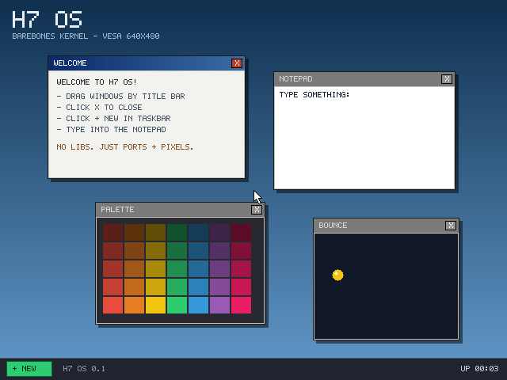

# H7 OS — barebones kernel with a draggable-window GUI

A tiny x86 operating system written from scratch: custom bootloader, 32-bit
protected-mode kernel, VESA framebuffer graphics, PS/2 mouse + keyboard
drivers, and a compositing window manager with draggable windows.

**Zero external libraries.** No GRUB, no libc, no compiler headers — just
NASM assembly, freestanding C, and hardware ports.



## Run it

```sh
make run        # build + boot in QEMU
make test       # headless smoke test: boots, drags a window, types,
                # closes a window; saves build/shot*.png screenshots
```

Requires `nasm`, `i686-elf-gcc` (Homebrew: `brew install i686-elf-gcc`),
and `qemu` — all already detected on this machine.

## What it does

- Desktop with gradient wallpaper, taskbar, uptime clock
- **Draggable windows** — grab the title bar, drop shadows, click to
  focus/raise (z-order), red `X` to close, `+ NEW` button spawns more
- **WELCOME** window (help text), **NOTEPAD** (type on the keyboard, it
  goes to the focused notepad), **PALETTE** (color grid), **BOUNCE**
  (animated ball, proves the compositor runs at ~100 fps)

## Boot flow

| Stage | File | What happens |
|---|---|---|
| 1 | `boot/stage1.asm` | 512-byte MBR. Loads stage 2 via BIOS INT 13h ext. |
| 2 | `boot/stage2.asm` | Enables A20, loads the kernel to `0x10000`, scans VESA modes for 640×480 with a linear framebuffer (32bpp, 24bpp fallback), stores a boot-info struct at `0x9000`, enters protected mode. |
| 3 | `kernel/entry.asm` | Sets the stack, zeroes `.bss`, calls `kmain`. |

## Kernel layout

| File | Purpose |
|---|---|
| `kernel/main.c` | `kmain`: init subsystems, then `hlt`-paced frame loop |
| `kernel/idt.c` | IDT, PIC remap, PIT timer at 100 Hz |
| `kernel/ps2.c` | PS/2 keyboard (scancode set 1) and mouse (3-byte packets, IRQ12) |
| `kernel/gfx.c` | Double-buffered framebuffer, primitives, hand-drawn 8×8 font |
| `kernel/wm.c` | Window manager: z-order, hit testing, drag, focus, taskbar, cursor |
| `kernel/entry.asm` | Entry stub + interrupt stubs bridging into C |

Everything renders into a 32bpp backbuffer at 3 MiB and is blitted to the
VESA framebuffer once per PIT tick (`rep movsl`). The mouse cursor, window
shadows (50% darken), and title-bar gradients are all drawn in software.

## Memory map

```
0x07C00  stage 1 (boot sector)
0x07E00  stage 2
0x09000  boot info (framebuffer address, pitch, resolution, bpp)
0x10000  kernel (flat binary, linked by linker.ld)
0x90000  kernel stack (grows down)
0x300000 32bpp backbuffer
```
